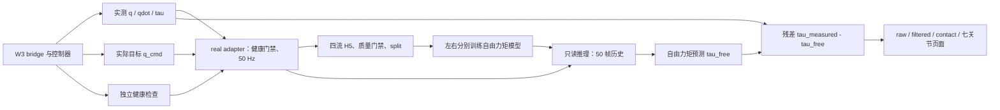

# W3 / NEXT 操作指导

适用现场：同一台 Ubuntu 22.04 / ROS 2 Humble 计算机，双臂、无夹爪、空载，已经完成本机标定。阅读顺序：本页 → [采集与训练](07_collection_and_training.md) → [只读部署与接触验收](08_readonly_and_contact.md)。本指导不代表第 7、8 部分已经通过真机验收。

## 1. 目前完成了什么

| 阶段 | 已实现、已离线验证的能力 |
|---|---|
| 1 | NEXT 独立 Python 环境、W3 接口契约、左右七关节配置 |
| 2 | W3 发布位置控制器**实际采用的目标** `/joint_position_controller/command_state` |
| 3 | 标准状态适配器、原始电机反馈健康检查、real profile 健康门禁 |
| 4 | 四流同步 H5 录制、断流分段、严格质量检查、按内容哈希隔离的数据清单 |
| 5 | manifest 驱动训练、训练集归一化、validation 最佳 checkpoint、完整数据的 Nm 指标和 baseline |
| 6 | 只读推理、50 帧预热和失效状态、左右独立模型、七关节网页、双侧 launch |

证据见 [1–6 验收索引](../../README.md)。第 6 部分最终有 51 项功能测试和双侧 10 分钟 mock 推理验证；**现有 smoke 权重来自合成数据，不能作为合格真机模型部署**。下一步需要真实自由运动数据、冻结的误差预算和真实接触试验。



每侧输入为 `[q, qdot, q_cmd-q]`，每帧 21 维；50 Hz × 50 帧约为 1 秒历史。单向 stateless LSTM 输出末帧七维自由力矩，单位 Nm。50 帧是上下文长度，不等于固定 1 秒接触检测延迟。残差还包含建模误差、摩擦及噪声，不能直接称为六维末端力。

## 2. 两个仓库怎么分工

| 位置 | 用途 |
|---|---|
| `/home/dingyj/w3_dual_arm_ws/src` | CAN bridge、ros2_control、标定、轨迹、W3 操作网页；负责驱动真机 |
| W3 `src/ros2_ws_config` | 本机零偏/方向和摩擦文件；控制器运行时读取 |
| `/home/dingyj/factr2/factr2_next/src/factr2_next` | NEXT 录制、训练、评估、推理、网页核心 |
| FACTR2 `factr2_w3_adapter` | W3 → NEXT 适配器及独立健康器 |
| FACTR2 `config/w3` / `scripts` / `docs` | 配置模板、检查/测试/回放工具、契约与报告 |
| FACTR2 `data` / `runs` / `reports/generated` | 实验配置与原始数据、权重、完整评估产物；Git 忽略 |
| 两仓库 `build` / `install` / `log`；FACTR2 `.venv` | 各自构建、环境、日志和缓存；Git 忽略 |

上游 Piper/Gello、teacher-arm、其他 bringup 包是原始工程保留内容。本流程构建 NEXT 核心与 adapter，不启动这些设备或反馈节点。

2026-10-05 已核对 W3 本机 `joint_offsets_left.yaml`、`joint_offsets_right.yaml` 各有七关节且 `complete: true`；`joint_offsets_dual.yaml` 有十四关节，名字、channel、slot、零偏和方向与两份单臂文件一致。它们在 W3 `src/ros2_ws_config/` 中且不提交 Git。UI 启动双臂控制端会读取合并文件，启动单臂会读取对应单臂文件。每次核对启动日志中的实际路径及实物姿态；若装配未变、文件正确，不重做标定。文件结构正确仍需实物核对。

## 3. 环境与构建：只在这里设置一次

**以下 W3 和 NEXT 两类环境分别用于各自的新终端。不要在同一 shell 叠加两个 install 或激活 NEXT venv 后运行 W3。** 本机统一 domain 73、localhost-only=1、Fast DDS。若控制系统已在其他 domain 运行，先统一记录实际 domain，所有观察节点跟随它；不要为接 NEXT 重启正在运动的控制端。

### W3 类终端

在每个 W3 终端执行：

```bash
cd /home/dingyj/w3_dual_arm_ws
mkdir -p log/ros log/tmp
env -i HOME="$HOME" USER="${USER:-dingyj}" PATH=/usr/bin:/bin LANG=C.UTF-8 \
  PYTHONNOUSERSITE=1 ROS_DOMAIN_ID=73 ROS_LOCALHOST_ONLY=1 \
  RMW_IMPLEMENTATION=rmw_fastrtps_cpp ROS_LOG_DIR="$PWD/log/ros" TMPDIR="$PWD/log/tmp" \
  FASTRTPS_DEFAULT_PROFILES_FILE=/home/dingyj/factr2/config/w3/dds_loopback.xml \
  bash --noprofile --norc
source /opt/ros/humble/setup.bash
source install/local_setup.bash
export ROS_LOCALHOST_ONLY=1
```

成功判据：`ros2 pkg prefix ieir_controllers`、`ros2 pkg prefix ieir_bringup` 指向本 W3 工作区，`python3` 为系统 Python 3.10。若指向旧工作区或出现 NumPy/Pinocchio ABI 错误，关闭该 shell，从此入口重新进入。

### NEXT 类终端

在每个 NEXT 终端执行；后续命令始终保留 `scripts/next.sh` 前缀：

```bash
cd /home/dingyj/factr2
export ROS_DOMAIN_ID=73 ROS_LOCALHOST_ONLY=1 RMW_IMPLEMENTATION=rmw_fastrtps_cpp
export FASTRTPS_DEFAULT_PROFILES_FILE="$PWD/config/w3/dds_loopback.xml"
scripts/next.sh python scripts/environment_probe.py
```

成功判据：解释器在 FACTR2 `.venv`，overlay 只有 Humble 与 FACTR2；日志、临时文件、Matplotlib 缓存均在 FACTR2 内。`next.sh` 使用独立子 shell，外层的 `VIRTUAL_ENV` 不会改变 W3 环境。双方都使用上述 loopback XML，避免多进程发现范围不足；跨机时不能沿用此 XML。

### 什么时候需要构建

| 情况 | 操作与通过条件 |
|---|---|
| 当前工作区已有 `.venv`、`install`，未改代码 | 不重复安装；NEXT 执行 `scripts/next.sh ros2 pkg executables factr2_next` 和 `scripts/next.sh python scripts/check_w3_configs.py`，应有五个入口及模板 PASS |
| NEXT 首次缺少环境 | 在 NEXT 终端执行 `bash scripts/setup_next_env.sh`，再执行下方 NEXT 构建；依赖只进入项目 venv |
| NEXT 核心/adapter 的包配置或 launch 修改 | 执行下方 NEXT 构建并重启相关节点；Python symlink 编辑也需重启已有进程 |
| W3 C++、包内 YAML、launch 修改或首次构建 | 在 W3 环境执行 `bash src/scripts/build_workspace.sh "$PWD"`；成功后新开 W3 shell。缺 apt 依赖先按 [W3 README](../../../w3_dual_arm_ws/src/README.md) 检查，不在 NEXT venv 安装替代库 |
| 仅填写 FACTR2 的实验 YAML | 校验配置并重启相应节点，无需重新编译 |
| W3 标定改变 | 停止控制端后重新合并并重启控制端，无需编译；重新核对数据/model profile，旧模型不自动适用 |

```bash
# NEXT 终端；只构建本流程的两个包
scripts/next.sh python -m colcon build \
  --base-paths factr2_next/src/factr2_next factr2_w3_adapter --symlink-install
```

## 4. 先掌握 W3 控制台

下表中的每个长期进程独占一个相应类型的终端；检查命令另外开终端。

| 终端角色 | 用途 | 成功判据 / 失败先查 |
|---|---|---|
| W3-bridge | 唯一 bridge；手动启动 | raw state 可见；查 can0/1、供电、FD 参数、domain |
| W3-UI | 唯一受管理网页及其控制子进程 | 8766 可访问；查端口、workspace 与已有外部控制端 |
| W3-健康 / W3-审计 / W3-检查 | 健康器、rosbag、只读命令 | raw 自定义消息可解码；查 W3 overlay、QoS |
| NEXT-adapter（每侧） / NEXT-recorder（每侧） | 四流与 H5 | adapter OK、约 50 Hz；查实际位置控制和健康器 |
| NEXT-工具 / NEXT-推理 | 离线检查训练、单/双侧只读 launch | 配置/模型匹配；查路径、side、状态原因 |

**现场操作顺序：**

1. **W3-检查：**双臂支撑、运动空间和急停确认后，运行 `ip -details -statistics link show can0` 与 `can1`。应为本机既有 CAN FD 配置、UP，无持续 bus-off/error。接口缺失或参数不符，按 W3 既有流程处理；不要在控制运行时重配总线。
2. **W3-bridge：**运行下面第一条命令。bridge 不自动使能；使能前没有完整有效反馈不等于故障。
3. **W3-UI：**运行下面第二条命令，打开 [W3 控制台](http://127.0.0.1:8766)。打开页面不会使能；若已有外部控制端，不重复启动，先确认其归属。
4. **网页：**核对运行配置和模型/实物，打开“允许控制”，选择“双臂”，确认“启动控制端”。**此动作会使能双臂并进入重力模式，须支撑全臂。**正常应有新鲜反馈和控制器状态；异常先按 W3 停机流程处理，再检查标定加载路径、健康和日志。

```bash
# W3-bridge
ros2 launch ieir_bringup bridge.launch.py arms:=dual gripper:=false
```

```bash
# W3-UI
ros2 launch ieir_bringup ui.launch.py workspace:="$PWD" gripper:=false
```

| 网页动作 | 实际影响与正常现象 | 操作要点 |
|---|---|---|
| 重力补偿 | gravity active，位置控制 inactive；可示教 | 不等于位置锁定或失能；手拖只制作运动轨迹 |
| 切“关节位置” | joint_position active，保留重力前馈 | 采 NEXT 自由运动数据需要此模式；勿同时使用笛卡尔/遥操作目标 |
| “读取当前”→编辑草稿→确认发送 | 发送所选侧目标与插值时间，实测逐步变化 | UI 为度，ROS 为 rad；J1..J7 = joint_0..6。先单侧小范围验证，发送成功不代表路径安全或已到达 |
| 示教记录 | 20 Hz 采样位置，最多 120 s，保存 W3 `recordings/web_*.yaml` | 开始示教不会替你切重力模式；双臂在线时可能记录十四个关节，回放按文件关节集合执行 |
| 回放 | 会发运动目标；网页默认半速、5 s 进入起点、50 Hz 目标流 | 检查全部被记录关节的起点与扫掠范围；结束后以 `list_controllers` 确认模式 |
| 回零 | 自动切位置模式并运动至模型零位 | 不是标定，也没有碰撞规划；本采集流程不要求先回零 |

**W3-检查：**`ros2 control list_controllers`；位置采集时应有 `joint_state_broadcaster`、`gravity_compensation_controller`、`joint_position_controller` active，笛卡尔控制器 inactive。在位置控制 active 后检查：

```bash
ros2 topic echo /joint_states --qos-reliability best_effort --once
ros2 topic echo /joint_position_controller/command_state --qos-reliability best_effort --once
```

应有预期关节名字、position/velocity/effort 数组与推进的源时间。采集启动和正式门禁见下一页；不要把手写 JointTrajectory 的稀疏点当成实际 q_cmd。

关闭/锁定浏览器不停止已有运动。结束实验时先停录和 NEXT，随后由操作者支撑全臂、停止 W3 回放/遥操作、停止控制端并确认失能，最后停 UI/bridge。停止 NEXT 只停止估计；停止 W3 控制端可能失去托举，Ctrl-C 也不等于物理急停。

## 5. 还需要补什么

| 已可直接使用 | 正式第 7/8 部分仍需交付 |
|---|---|
| 既有网页、小范围关节目标、示教回放 | 自由运动协议、每侧覆盖清单、轨迹审核记录；批量采集还缺离线轨迹生成/严格校验工具 |
| real adapter、recorder、strict checker、manifest、正式训练与评估 | 真机 session、冻结预算、三种子结果、关键分组和逐关节 baseline 补充检查、合格模型 |
| 只读 launch、七关节网页、状态与 rosbag | 接触协议、独立事件标记、接触/误报/恢复统计及完整在线时延分析工具 |

首次 pilot 可用现有工具开始，不需要新写控制器或重新构建整套运动系统。正式验收仍需补齐上述协议、统计证据和 [第 7](../development/7_real_data_and_model_validation.md)、[第 8](../development/8_readonly_deployment_and_contact_validation.md) 报告。新增运行代码时重跑受影响的离线验收；本指导仅增加文档。
